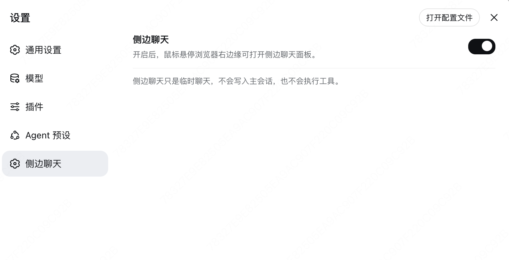

# dsh-sidechat

**English** | [中文](README.md)

Side chat panel for the **DeepSeek Harness** web GUI: hover the right edge of
the browser to open a chat column beside the main conversation, grounded in the
current project and session context.




## Features

| Capability | Description |
| --- | --- |
| Hover to open | Move the mouse to the browser's right edge to slide the panel in, side by side with the main conversation |
| Project context | The panel injects the project root and current Git branch into every reply |
| Session context | Answers stay consistent with the main conversation (last 12 messages) |
| Streaming output | Replies stream token by token; generation can be stopped mid-flight |
| Reasoning display | Model reasoning streams into a collapsible "💭 Reasoning" block |
| Markdown | Headings, bold/italic, code blocks, lists, quotes, links, and tables |
| Model / reasoning effort | Switch model and reasoning effort inside the panel (effort only when the model supports it) |
| Clear | One-click clear with an irreversible second confirmation |
| Selection to send | Select text in the main chat → "Add to side chat" → send it directly |
| Settings switch | Settings → Side chat: turn the whole feature on or off at any time |
| Ephemeral notice | A persistent "Side chat is temporary" tip at the bottom of the panel |

## Install

This package is a self-contained bundle: the host half (`SidechatService`)
registers the `sidechat` Remote service and the browser half (the `./client`
bundle) is picked up by the harness's client-modules roster, so **no web
rebuild is needed**. Built artifacts are committed to the repository, so the
install runs no build scripts and requires no build permission.

### One-line install from GitHub

```sh
pnpm dsh plugin --profile web add github:kittsai/dsh-sidechat
```

Then restart `dsh web` and hover the right edge of the window.

### Install from a local directory

```sh
pnpm dsh plugin --profile web add /path/to/dsh-sidechat
```

This links the directory directly (no prepare, no `allowBuilds` entry).

## Uninstall

```sh
pnpm dsh plugin --profile web remove dsh-sidechat
```

## Usage tips

- The panel opens only by hovering the right edge and closes with ✕; clicking
  the main conversation does not collapse it.
- Side chat is an independent Q&A surface: it does not write to the main
  session and has no tools — good for conceptual, explanation, and
  planning-style questions.
- With reasoning effort `high` / `max` the model thinks first; the reasoning
  block auto-expands while generating.

## Repository structure

```
cordis.patch.yml                  # bundle patch: one row naming this package
src/index.ts                      # host half: SidechatService (default export)
src/client/                       # browser half: apply + panel components
src/client/remote.ts              # hand-written Remote contribution (self-mounted)
tsdown.config.ts                  # host transpile + client bundle build
lib/                              # committed build artifacts (no build at install)
```

## Development

The build transpiles `src/` into `lib/` with `tsc` + `tsdown`; type resolution
for `@deepseek-ai/*` peers points at a sibling `deepseek-harness` checkout's
build artifacts (see `tsconfig.json` `paths`). After changing sources, rebuild
and commit the artifacts:

```sh
pnpm install   # public toolchain only (react, zod, tsdown, typescript, lightningcss)
pnpm run build
```

## License

MIT
