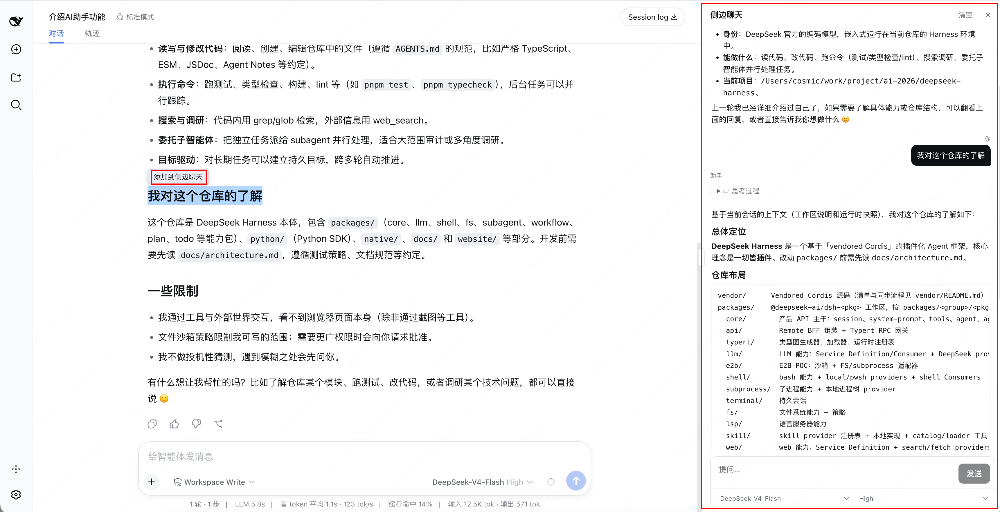

# dsh-sidechat

**中文** | [English](README.en.md)

面向 **DeepSeek Harness** Web GUI 的侧边聊天面板：鼠标悬停浏览器右边缘即可打开一个与主对话并排的聊天栏，回答基于当前项目与会话上下文。



## 功能

| 能力 | 说明 |
| --- | --- |
| 悬停呼出 | 鼠标移到浏览器右边缘，面板滑入，与主对话并排显示 |
| 项目上下文 | 每次回答自动注入项目根目录与当前 Git 分支 |
| 会话上下文 | 与主对话保持上下文一致（最近 12 条消息） |
| 流式输出 | 回答逐字流式显示，可中途停止生成 |
| 思考过程 | 模型推理内容流式显示为可折叠的「💭 思考过程」块 |
| Markdown | 标题、粗体/斜体、代码块、列表、引用、链接和表格 |
| 模型 / 推理等级 | 面板内直接切换模型与推理等级（仅当模型支持时显示） |
| 清空 | 一键清空，带「不可恢复」二次确认 |
| 选中发送 | 在主聊天中选中文本 →「添加到侧边聊天」→ 直接发送 |
| 设置开关 | 左下角设置 →「侧边聊天」，可随时开启/关闭整个功能 |
| 临时提示 | 面板底部常驻「侧边聊天只是临时聊天」提示 |

## 安装

本包为自包含 bundle：host 半（`SidechatService`）注册 `sidechat` Remote 服务，浏览器半（`./client` bundle）由 harness 的 client-modules roster 加载，因此**无需重建 web**。构建产物已提交到仓库，安装时不运行任何构建脚本，也无需构建权限。

### GitHub 一行安装

```sh
pnpm dsh plugin --profile web add github:kittsai/dsh-sidechat
```

然后重启 `dsh web`，悬停窗口右边缘即可使用。

### 本地目录安装

```sh
pnpm dsh plugin --profile web add /path/to/dsh-sidechat
```

直接链接目录（无 prepare、无需 `allowBuilds` 条目）。

## 卸载

```sh
pnpm dsh plugin --profile web remove dsh-sidechat
```

## 使用提示

- 面板只通过「悬停右边缘」打开，✕ 关闭；点击主对话不会收起
- 侧边聊天是**独立问答面**：不写入主会话，也没有工具——适合概念、解释和方案类问题
- 推理等级选 `high` / `max` 时模型先思考；生成中思考块自动展开

## 仓库结构

```
cordis.patch.yml                  # bundle 补丁：一行声明本包
src/index.ts                      # host 半：命名导出 apply + SidechatService
src/typert.ts                     # 手写 ./typert manifest（strict codecs）
src/client/                       # 浏览器半：apply + 面板组件
src/client/remote.ts              # 手写 Remote contribution（自挂载）
tsdown.config.ts                  # host 转译 + client bundle 构建
lib/                              # 已提交的构建产物（安装时无需构建）
```

## 开发

构建用 `tsc` + `tsdown` 将 `src/` 转译为 `lib/`；`@deepseek-ai/*` 对等依赖的类型解析指向同级 `deepseek-harness` 检出的构建产物（见 `tsconfig.json` 的 `paths`）。修改源码后重新构建并提交产物：

```sh
pnpm install   # 仅公开工具链（react, zod, tsdown, typescript, lightningcss）
pnpm run build
```

## License

MIT
